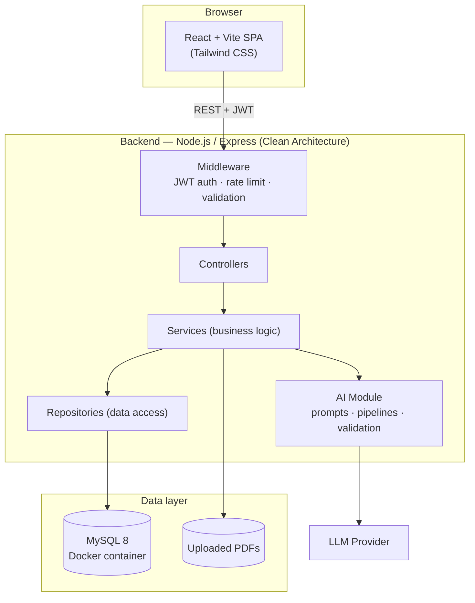
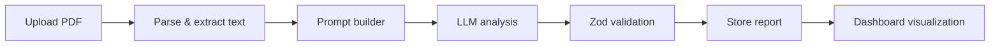

<div align="center">

# AcadIQ

**AI-powered academic intelligence platform for faculty.**

Built for the AUST CSE Carnival AI Build Hackathon.

[](https://nodejs.org)
[](https://react.dev)
[](https://www.typescriptlang.org)
[](https://expressjs.com)
[](https://www.mysql.com)
[](https://www.prisma.io)
[](https://www.docker.com)
[](#)

</div>

---

## Overview

AcadIQ helps university faculty **design, review, and improve** courses and exams using AI — without ever taking the decision out of the faculty member's hands. Upload a syllabus and a question paper; get back a structured, evidence-based quality report faculty can act on.

## Problem Statement

Faculty spend significant, largely manual effort ensuring an exam:

- covers the syllabus proportionally,
- balances Bloom's-taxonomy difficulty instead of leaning on recall,
- doesn't quietly repeat last year's questions, and
- distributes marks sensibly across topics and learning outcomes.

This is tedious to check by hand across every course, every semester, and easy to get subtly wrong.

## Solution

AcadIQ ingests a course's syllabus and question papers (PDF), and runs three focused AI analyses — **Exam Quality**, **Syllabus Coverage**, and **Question Similarity** — each producing a structured report with concrete, prioritized recommendations. The AI never grades or approves anything on its own; it hands faculty evidence and suggestions, and faculty decide.

## Features

- **AI Exam Quality Analyzer** — topic coverage, Bloom's taxonomy distribution, learning-outcome alignment, marks distribution.
- **Question Similarity Detector** — flags duplicate questions and repeated patterns against previous-year papers, with a similarity percentage.
- **Syllabus Coverage Analyzer** — covered vs. missing vs. overused topics, exam vs. syllabus.
- **AI Recommendation Engine** — plain-language, priority-ranked suggestions grounded in the same evidence as the scores (e.g., *"Too many recall-based questions — add more analytical items."*).
- **Full audit in one click** — runs every analysis for a paper and reports per-step outcomes; **PDF export** for moderation paperwork.
- **Dual-LLM Evaluator** — two models from different vendors score a student answer against your marking scheme; disagreement is flagged for faculty review.
- **Multi-provider AI with automatic failover** — configure several providers; if one is rate-limited or out of credit, the next one answers. Faculty can pick a specific model or leave it on Auto, and every answer shows which model produced it.
- **Faculty dashboard** — course pages with per-term quality trends, document upload, visual reports (Chart.js), JWT-secured multi-user access.

## System Architecture



Full architecture write-up: [`docs/ARCHITECTURE.md`](docs/ARCHITECTURE.md) · ER diagram: [`docs/ER_DIAGRAM.md`](docs/ER_DIAGRAM.md) · AI pipeline: [`docs/AI_PIPELINE.md`](docs/AI_PIPELINE.md) · API reference: [`docs/API.md`](docs/API.md)

## Technology Stack

**Frontend:** React 18, Vite, TypeScript, Tailwind CSS, React Router, Zustand, Chart.js
**Backend:** Node.js, Express, TypeScript, Clean Architecture (MVC + Service Layer), JWT, Zod
**Database:** MySQL 8 (Docker), Prisma ORM, versioned migrations
**AI:** OpenAI-compatible LLM APIs (multi-provider registry with ordered failover and user-selectable models), structured-JSON prompting, Zod-validated response pipeline
**Infra:** Docker, Docker Compose

## Installation Guide

### 1. Clone the repository

```bash
git clone <this-repo-url> AcadIQ
cd AcadIQ
```

### 2. Environment setup

```bash
cp .env.example .env
cp backend/.env.example backend/.env
cp frontend/.env.example frontend/.env
# then edit .env files: JWT_SECRET, OPENAI_API_KEY (or GROQ_API_KEY), DB credentials
# optional: add more AI providers for failover via AI_PROVIDERS_JSON — see docs/ai-providers.md
```

### 3. Install dependencies (for local, non-Docker dev)

```bash
cd backend && npm install
cd ../frontend && npm install
```

### 4. Start MySQL (Docker)

```bash
docker compose up -d mysql
```

### 5. (Optional) Local AI via Ollama

Only needed for the **AI Hub** pages — PDF Assistant, Image Assistant and Question Generator — which run offline on your own machine instead of a cloud provider. Every other feature (analyses, Copilot, the assistant) uses the cloud providers and works without this.

```bash
winget install --id Ollama.Ollama -e     # macOS/Linux: see https://ollama.com/download
ollama pull gemma3:4b                    # text + RAG   (~3 GB)
ollama pull qwen2.5vl:3b                 # vision       (~3 GB)
ollama pull nomic-embed-text             # embeddings   (~0.3 GB)
```

The installer starts a server on `http://localhost:11434` automatically; `ollama serve` fails with a port-in-use error if it is already running. `GET /api/ai/status` reports what the backend can see, and the AI Hub shows "Ollama Offline" plus a "Needs pull" badge per missing model. Expect slow responses on CPU-only machines.

**If every model returns gibberish, force CPU.** On a machine whose GPU backend Ollama cannot drive correctly, models load onto the GPU and then emit corrupt output — random non-Latin glyphs followed by one unused token repeated until the runner aborts with `token repeat limit reached` or `Unexpected empty grammar stack`. It affects text and vision models alike, so it looks like a broken install rather than a driver problem. Check `ollama ps` (it will report `100% GPU`) and the server log for a line such as `AMD driver is too old`. Set `OLLAMA_NUM_GPU=0` in `backend/.env` to run on CPU instead: slower, but correct. Remove that line once the GPU driver is updated.

These models are separate from the question-similarity embeddings, which run in-process via Transformers.js and need no Ollama.

## Running the project

### Option A — everything in Docker

```bash
docker compose --profile full up -d
```

- Frontend → http://localhost:5173
- Backend API → http://localhost:5000/api
- MySQL → localhost:3308

### Option B — local dev (hot reload)

```bash
docker compose up -d mysql     # database only; app containers are behind the `full` profile

# terminal 1
cd backend && npm run dev

# terminal 2
cd frontend && npm run dev
```

> Do not run the `full` profile and `npm run dev` at the same time — both bind port 5000 and the container will silently answer instead of your dev server.

## Database Setup

```bash
cd backend
npm run prisma:generate        # generate the Prisma client
npm run prisma:migrate         # create & apply migrations (dev)
npm run prisma:migrate:deploy  # apply migrations (CI/production)
npm run prisma:studio          # optional: browse data at localhost:5555
```

See [`database/README.md`](database/README.md) for schema details.

## API Documentation

Full request/response reference: [`docs/API.md`](docs/API.md).

| Method | Endpoint | Purpose |
|---|---|---|
| `POST` | `/api/auth/register` | Create a faculty/admin account |
| `POST` | `/api/auth/login` | Authenticate, receive JWT |
| `GET` / `POST` | `/api/courses` | List / create courses |
| `POST` | `/api/documents/upload` | Upload a syllabus or question-paper PDF |
| `POST` | `/api/analysis/exam` | Run the Exam Quality Analyzer |
| `POST` | `/api/analysis/question-review` | Review question clarity and cognitive quality |
| `POST` | `/api/analysis/co-mapping` | Map questions to course outcomes |
| `POST` | `/api/analysis/syllabus` | Run the Syllabus Coverage Analyzer |
| `POST` | `/api/analysis/similarity` | Run the Question Similarity Detector |
| `POST` | `/api/analysis/full` | Run every analysis for a paper in one call (per-step outcomes) |
| `POST` | `/api/analysis/dual-evaluate` | Two-model consensus grading of a student answer |
| `GET` | `/api/ai/models` | List the configured AI models a user can choose from |
| `GET` | `/api/reports/:id` | Fetch a stored analysis report |
| `GET` | `/api/reports/:id/pdf` | Download a report as PDF |

## AI Workflow



Details, prompt design, and error-handling rules: [`docs/AI_PIPELINE.md`](docs/AI_PIPELINE.md).

## Screenshots

_Add dashboard/report screenshots here before the demo._

## Future Improvements

- Multi-institution support with per-department admin roles.
- Direct LMS integration (Moodle/Canvas) for automatic paper ingestion.
- Historical trend view across semesters for a given course.
- Fine-tuned, subject-specific Bloom's-level classification.

## Team Members

_Add team member names and roles here._

---

<div align="center">

🤖 Generated with [Claude Code](https://claude.com/claude-code)

</div>
