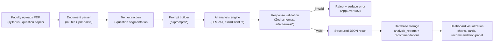

# AI Processing Pipeline

AcadIQ's AI is explicitly **decision-support**, not decision-making: every pipeline stops at "here's evidence and a suggestion" — faculty apply their own judgment before acting on it.

## Flow

## Stage details

1. **Upload** — `POST /api/documents/upload` (multipart, PDF only, 10MB cap, enforced in `middleware/upload.middleware.ts`).
2. **Parse** — `utils/pdfParser.ts` extracts raw text; `services/upload.service.ts` segments question papers into individual questions using a numbering heuristic (`Q1`, `1.`, etc.) and best-effort marks extraction.
3. **Prompt management** — each analysis type has its own prompt module under `ai/prompts/`, separating the *system* instruction (task definition + strict output contract) from the *user* content (syllabus/question text). This keeps prompts versionable and testable independent of the LLM call itself.
4. **AI analysis engine** — `ai/llmClient.ts` calls an OpenAI-compatible chat completions endpoint with `response_format: json_object`, so the model is constrained to return JSON. The provider/model are configured via env vars (`OPENAI_BASE_URL`, `OPENAI_MODEL`), keeping the pipeline vendor-agnostic.
5. **Response validation** — `ai/schemas/analysisResponse.schema.ts` (Zod) validates the LLM's JSON against the exact shape the frontend expects. A failed validation raises an `AppError(502)` instead of persisting malformed data — the analysis is retried or surfaced as an error to the faculty member, never silently stored.
6. **Storage** — validated results are stored in `analysis_reports.result_json` (full structured result) and exploded into `recommendations` rows (message + priority) for querying/sorting.
7. **Visualization** — the frontend renders `result_json` via Chart.js (`BloomChart`, `CoverageChart`) and the `RecommendationPanel`/`ReportViewer` components — no re-computation, just rendering what was validated and stored.

## Error handling

| Failure | Handling |
|---|---|
| Missing `OPENAI_API_KEY` | `AppError(503)` — "AI provider is not configured" |
| LLM HTTP error | Logged, `AppError(502)` — "AI analysis request failed" |
| Non-JSON / malformed LLM output | `AppError(502)` — "AI provider returned malformed JSON" |
| JSON that doesn't match the expected schema | `AppError(502)` with Zod's flattened error details — "AI response failed validation" |
| Missing syllabus/question paper prerequisites | `AppError(400/404)` before any LLM call is made (fail fast, save the API call) |

## Intelligence analyses mapped to pipelines

| Feature | Endpoint | Pipeline | Prompt |
|---|---|---|---|
| Exam Quality Analyzer | `POST /api/analysis/exam` | `ai/pipeline/examAnalysisPipeline.ts` | `ai/prompts/examAnalysis.prompt.ts` |
| Question Review | `POST /api/analysis/question-review` | `ai/pipeline/questionReviewPipeline.ts` | `ai/prompts/questionReview.prompt.ts` |
| Course Outcome Mapping | `POST /api/analysis/co-mapping` | `ai/pipeline/coMappingPipeline.ts` | `ai/prompts/coMapping.prompt.ts` |
| Syllabus Coverage Analyzer | `POST /api/analysis/syllabus` | `ai/pipeline/syllabusPipeline.ts` | `ai/prompts/syllabusAnalysis.prompt.ts` |
| Question Similarity Detector | `POST /api/analysis/similarity` | `ai/pipeline/similarityPipeline.ts` | `ai/prompts/similarity.prompt.ts` |
| Academic Memory Engine | `POST /api/memory/check` | `ai/pipeline/academicMemoryPipeline.ts` | `ai/prompts/academicMemory.prompt.ts` |

The Recommendation Engine isn't a separate pipeline — each analysis prompt is required to emit a `recommendations` (or single `recommendation`) field as part of its structured output, so suggestions are always grounded in the same evidence used for scoring.
