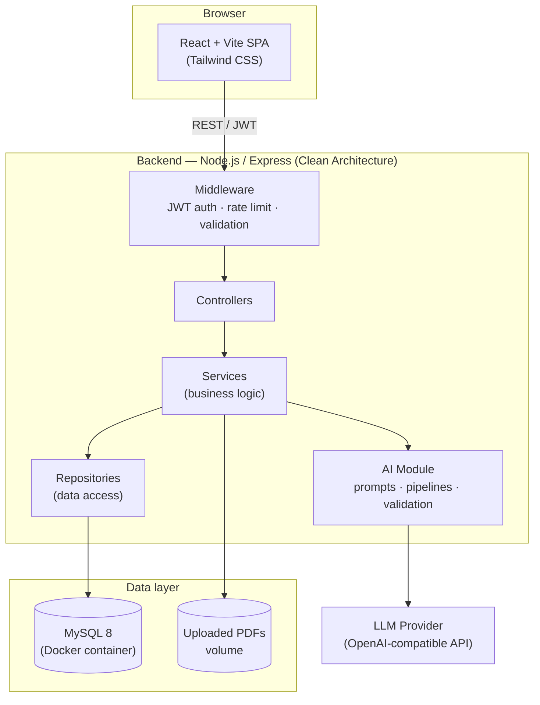

# AcadIQ — System Architecture

## 1. High-level system diagram



## 2. Monorepo layout

```
AcadIQ/
├── frontend/     React + Vite + TS SPA — faculty-facing dashboard
├── backend/      Express + TS API — Clean Architecture, Prisma ORM
├── database/     DB documentation + MySQL container init scripts
├── docs/         Architecture, API, ER diagram, AI pipeline docs
├── docker-compose.yml
└── README.md
```

| Folder | Responsibility |
|---|---|
| `frontend/` | All UI code: pages, layouts, reusable components, API client, client-side auth state. Talks to the backend only via `VITE_API_URL`. |
| `backend/` | REST API. Owns authentication, business rules, database access, and AI orchestration. Nothing outside it touches MySQL directly. |
| `database/` | Not a running service — documents the schema and holds one-time MySQL init scripts. The schema itself lives in `backend/prisma/schema.prisma`. |
| `docker-compose.yml` | Wires `mysql`, `backend`, `frontend` into one network for local dev and demo. |
| `docs/` | Architecture/API/ER/AI references, kept close to the code they describe. |

## 3. Backend — Clean Architecture / MVC + Service Layer

```
backend/src/
├── config/        env loading & validation
├── controllers/   translate HTTP <-> service calls; no business logic
├── routes/        Express routers, wire middleware to controllers
├── middleware/     auth (JWT), RBAC, rate limiting, file upload, error handling
├── services/      business logic — the only layer that orchestrates repositories + AI
├── repositories/  Prisma queries only; nothing above this layer imports Prisma directly
├── models/        domain types not covered by Prisma's generated models (AI result shapes)
├── validators/    Zod schemas for request payloads
├── ai/            LLM client, prompt templates, response-validation pipelines
├── database/      shared Prisma client instance
├── app.ts         Express app assembly (middleware + routes)
└── server.ts      process entrypoint
```

**Dependency direction** (outer → inner, never reversed):

```
routes → controllers → services → repositories → database
                     ↘ ai (pipelines) → llmClient → external LLM
```

Controllers never call Prisma directly, and repositories never contain business rules — this keeps the AI/DB layers swappable (e.g., replacing the LLM provider or moving off MySQL) without touching controllers.

## 4. Why these choices

- **Clean Architecture / layered services** — the AI logic (prompting, response validation) is intentionally isolated in `ai/`, separate from `services/`, so a hackathon judge (or a future contributor) can see exactly where "the AI part" lives and swap providers without touching business rules.
- **Prisma over raw SQL** — migrations are version-controlled and reproducible across judges' machines; `prisma migrate deploy` is one command against the Dockerized MySQL.
- **JWT, stateless auth** — no session store needed, keeps the backend horizontally scalable and simple to demo.
- **Structured JSON contracts for AI output** — every AI pipeline (`ai/pipeline/*`) validates the LLM's response against a Zod schema before it ever reaches the database, so a malformed AI response fails loudly instead of corrupting a report.
