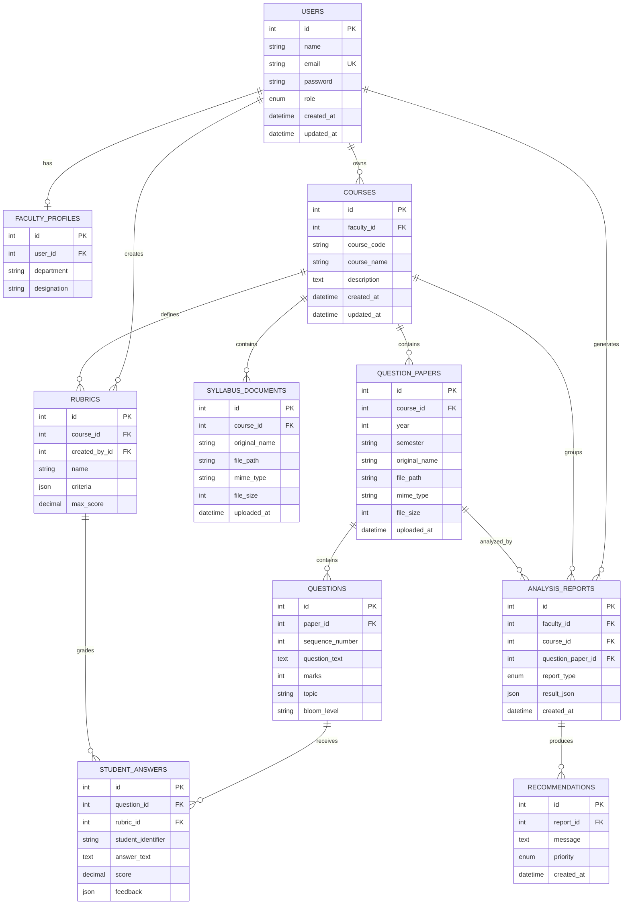

# Entity-Relationship Diagram

## Relationship notes

- `users.role` distinguishes `ADMIN` from `FACULTY`; only faculty users get a `faculty_profiles` row.
- A `course` belongs to exactly one faculty member (`courses.faculty_id → users.id`) but a faculty member can own many courses.
- Each `question_paper` is scoped to a `course` and tagged by `year`/`semester`, which is what lets the Question Similarity Detector compare "this year's paper" against "last year's paper" for the same course.
- `analysis_reports.result_json` stores the full structured AI output (topic coverage, Bloom distribution, similarity matches, etc.) so the dashboard can render rich reports without re-running the AI pipeline; `recommendations` are extracted into their own rows for filtering/sorting by `priority`.
- `rubrics.criteria` and `student_answers.feedback` are validated application JSON, allowing evolving assessment structures without losing relational ownership and grading links.
- All foreign keys cascade on delete, so removing a course cleans up its documents, papers, and questions.
